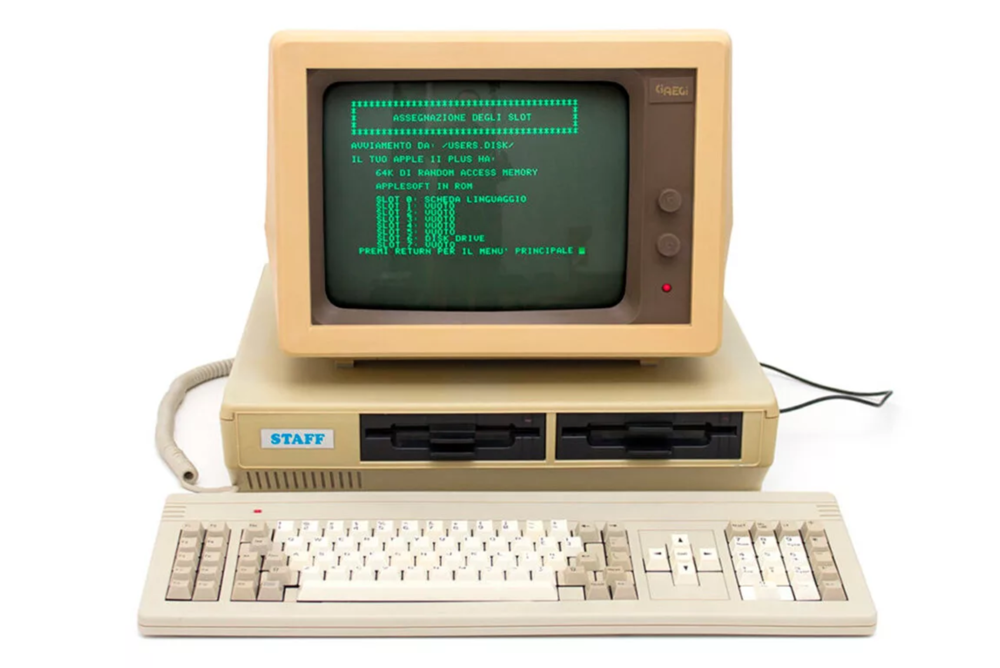

# Задача проекта:
написать собственную библиотеку на языке машинных команд на языке ассемблера
# Использование:
```
git clone https://github.com/ShamilSE/libasm
cd libasm
make
```
теперь вы можете линковать ваши файлы с этой библиотекой (gcc, ld)

